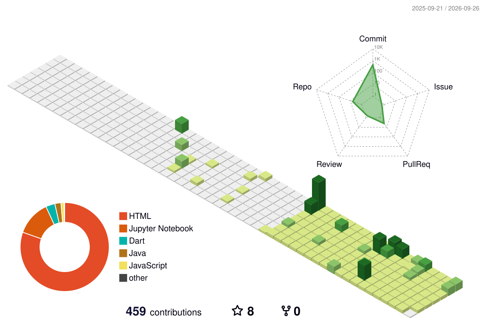

<div align="center">

<!-- ━━━━━━━━━━━━━━━━━━━ 3D HEADER BANNER ━━━━━━━━━━━━━━━━━━━ -->

<picture>
  <source media="(prefers-color-scheme: dark)" srcset="https://capsule-render.vercel.app/api?type=venom&color=gradient&customColorList=0,2,2,5,30&height=280&section=header&text=CHITRAJU%20VISHNU%20VINEETH&fontSize=52&fontColor=ffffff&animation=twinkling&fontAlignY=38&desc=Full%20Stack%20Developer%20%7C%20AI%2FML%20Enthusiast%20%7C%20Tech%20Innovator&descAlignY=58&descSize=16&descColor=8b949e&stroke=58A6FF&strokeWidth=2" />
  <source media="(prefers-color-scheme: light)" srcset="https://capsule-render.vercel.app/api?type=waving&color=gradient&customColorList=1,12,24,35,48&height=280&section=header&text=CHITRAJU%20VISHNU%20VINEETH&fontSize=52&fontColor=0969da&animation=twinkling&fontAlignY=38&desc=Full%20Stack%20Developer%20%7C%20AI%2FML%20Enthusiast%20%7C%20Tech%20Innovator&descAlignY=58&descSize=16&descColor=57606a&stroke=0969da&strokeWidth=2" />
  
</picture>

<br/>

<!-- ━━━━━━━━━━━ TYPING ANIMATION ━━━━━━━━━━━ -->

<a href="https://github.com/VishnuVineeth14">
  <picture>
    <source media="(prefers-color-scheme: dark)" srcset="https://readme-typing-svg.herokuapp.com?font=JetBrains+Mono&weight=600&size=22&duration=3000&pause=1000&color=58A6FF&center=true&vCenter=true&multiline=true&repeat=true&width=800&height=70&lines=%E2%9A%A1+Building+scalable+full-stack+web+%26+mobile+applications;%F0%9F%94%AC+Exploring+Data+Science%2C+AI+%26+Machine+Learning;%F0%9F%8E%AF+Turning+complex+problems+into+elegant+code" />
    <source media="(prefers-color-scheme: light)" srcset="https://readme-typing-svg.herokuapp.com?font=JetBrains+Mono&weight=600&size=22&duration=3000&pause=1000&color=0969DA&center=true&vCenter=true&multiline=true&repeat=true&width=800&height=70&lines=%E2%9A%A1+Building+scalable+full-stack+web+%26+mobile+applications;%F0%9F%94%AC+Exploring+Data+Science%2C+AI+%26+Machine+Learning;%F0%9F%8E%AF+Turning+complex+problems+into+elegant+code" />
    
  </picture>
</a>

<br/>

<!-- ━━━━━━━━━━━ SOCIAL BADGES & QUICK CONTACT ━━━━━━━━━━━ -->

<a href="https://linkedin.com/in/chitraju-vishnu-vineeth">
  
</a>
&nbsp;
<a href="mailto:vishnuvineeth2470039@ssn.edu.in">
  
</a>
&nbsp;
<a href="https://github.com/VishnuVineeth14">
  
</a>
&nbsp;
<picture>
  <source media="(prefers-color-scheme: dark)" srcset="https://komarev.com/ghpvc/?username=VishnuVineeth14&label=PROFILE+VIEWS&color=58A6FF&style=for-the-badge" />
  <source media="(prefers-color-scheme: light)" srcset="https://komarev.com/ghpvc/?username=VishnuVineeth14&label=PROFILE+VIEWS&color=0969DA&style=for-the-badge" />
  
</picture>

<br/><br/>

<picture>
  <source media="(prefers-color-scheme: dark)" srcset="https://img.shields.io/badge/🟢_STATUS-Open_to_Collaborations-39d353?style=for-the-badge&labelColor=0d1117" />
  <source media="(prefers-color-scheme: light)" srcset="https://img.shields.io/badge/🟢_STATUS-Open_to_Collaborations-2da44e?style=for-the-badge&labelColor=f6f8fa" />
  
</picture>
<picture>
  <source media="(prefers-color-scheme: dark)" srcset="https://img.shields.io/badge/🎯_FOCUS-Placement_Prep-f78166?style=for-the-badge&labelColor=0d1117" />
  <source media="(prefers-color-scheme: light)" srcset="https://img.shields.io/badge/🎯_FOCUS-Placement_Prep-cf222e?style=for-the-badge&labelColor=f6f8fa" />
  
</picture>
<picture>
  <source media="(prefers-color-scheme: dark)" srcset="https://img.shields.io/badge/📚_LEARNING-Always-58A6FF?style=for-the-badge&labelColor=0d1117" />
  <source media="(prefers-color-scheme: light)" srcset="https://img.shields.io/badge/📚_LEARNING-Always-0969DA?style=for-the-badge&labelColor=f6f8fa" />
  
</picture>

</div>

<br/>

---

## 👨‍💻 About Me

```yaml
developer:
  name: Chitraju Vishnu Vineeth
  role: Full Stack Developer & Engineering Student
  location: India 🇮🇳
  education: Computer Science / Engineering

current_passions:
  - 🚀 Crafting responsive web & mobile apps (Flutter, React, Node.js)
  - 🤖 Implementing Machine Learning algorithms & Data Science models
  - ⚡ Designing efficient, resilient database architectures
  - 🎯 Solving algorithmic challenges & preparing for industry roles

philosophy: "Build software that leaves a lasting impact through clean code & exceptional UX."
```

<br/>

---

## 🧠 Tech Arsenal

> 💡 *Click on any language or technology badge below to view the specific repository where I've implemented it!*

<div align="center">

### ⚡ Languages

<a href="https://github.com/VishnuVineeth14/Banking-Management-System" title="C — Used in Banking Management System">
  
</a>&nbsp;
<a href="https://github.com/VishnuVineeth14/Banking-Management-System" title="Java — Used in Banking Management System & SkyBookingSystem">
  
</a>&nbsp;
<a href="https://github.com/VishnuVineeth14/ML_LAB_ASSIGNMENTS" title="Python — Used in ML Lab Assignments & Data Science">
  
</a>&nbsp;
<a href="https://github.com/VishnuVineeth14/SkyBookingSystem" title="JavaScript — Used in Sky Booking System">
  
</a>&nbsp;
<a href="https://github.com/VishnuVineeth14?tab=repositories&q=&type=&language=kotlin" title="Kotlin — Click to see Kotlin Repositories">
  
</a>

<br/>

### 🎨 Frontend

<a href="https://github.com/VishnuVineeth14/SkyBookingSystem" title="HTML5 — Used in Sky Booking System & Web Projects">
  
</a>&nbsp;
<a href="https://github.com/VishnuVineeth14/SkyBookingSystem" title="CSS3 — Used in Sky Booking System & UI Components">
  
</a>&nbsp;
<a href="https://github.com/VishnuVineeth14?tab=repositories&q=react" title="React — Click to see React Repositories">
  
</a>

<br/>

### ⚙️ Backend & Frameworks

<a href="https://github.com/VishnuVineeth14?tab=repositories&q=flask" title="Flask — Used in Python Backend Services">
  
</a>&nbsp;
<a href="https://github.com/VishnuVineeth14/SkyBookingSystem" title="Node.js — Used in Sky Booking System">
  
</a>&nbsp;
<a href="https://github.com/VishnuVineeth14/SkyBookingSystem" title="Express.js — Used in Sky Booking System">
  
</a>

<br/>

### 🗄️ Databases

<a href="https://github.com/VishnuVineeth14?tab=repositories&q=mongo" title="MongoDB — Click to see MongoDB Repositories">
  
</a>&nbsp;
<a href="https://github.com/VishnuVineeth14/Banking-Management-System" title="MySQL — Used in Banking Management System">
  
</a>&nbsp;
<a href="https://github.com/VishnuVineeth14/Banking-Management-System" title="MSSQL — Used in Banking Management System">
  
</a>&nbsp;
<a href="https://github.com/VishnuVineeth14?tab=repositories&q=sqlite" title="SQLite — Click to see SQLite Repositories">
  
</a>&nbsp;
<a href="https://github.com/VishnuVineeth14?tab=repositories&q=neo4j" title="Neo4j — Click to see Neo4j Repositories">
  
</a>

<br/>

### 🧪 Data Science & Machine Learning

<a href="https://github.com/VishnuVineeth14/ML_LAB_ASSIGNMENTS" title="Python ML — Used in ML Lab Assignments">
  
</a>&nbsp;
<a href="https://github.com/VishnuVineeth14/ML_LAB_ASSIGNMENTS" title="Scikit-Learn — Used in ML Lab Assignments">
  
</a>&nbsp;
<a href="https://github.com/VishnuVineeth14/ML_LAB_ASSIGNMENTS" title="TensorFlow — Used in ML Lab Assignments">
  
</a>&nbsp;
<a href="https://github.com/VishnuVineeth14/ML_LAB_ASSIGNMENTS" title="Pandas — Used in ML Lab Assignments">
  <picture>
    <source media="(prefers-color-scheme: dark)" srcset="https://img.shields.io/badge/Pandas-150458?style=for-the-badge&logo=pandas&logoColor=white&labelColor=0d1117" />
    <source media="(prefers-color-scheme: light)" srcset="https://img.shields.io/badge/Pandas-150458?style=for-the-badge&logo=pandas&logoColor=white&labelColor=f6f8fa" />
    
  </picture>
</a>&nbsp;
<a href="https://github.com/VishnuVineeth14/ML_LAB_ASSIGNMENTS" title="NumPy — Used in ML Lab Assignments">
  <picture>
    <source media="(prefers-color-scheme: dark)" srcset="https://img.shields.io/badge/NumPy-013243?style=for-the-badge&logo=numpy&logoColor=white&labelColor=0d1117" />
    <source media="(prefers-color-scheme: light)" srcset="https://img.shields.io/badge/NumPy-013243?style=for-the-badge&logo=numpy&logoColor=white&labelColor=f6f8fa" />
    
  </picture>
</a>&nbsp;
<a href="https://github.com/VishnuVineeth14/ML_LAB_ASSIGNMENTS" title="Matplotlib — Used in ML Lab Assignments">
  <picture>
    <source media="(prefers-color-scheme: dark)" srcset="https://img.shields.io/badge/Matplotlib-ffffff?style=for-the-badge&logo=Matplotlib&logoColor=black&labelColor=0d1117" />
    <source media="(prefers-color-scheme: light)" srcset="https://img.shields.io/badge/Matplotlib-111111?style=for-the-badge&logo=Matplotlib&logoColor=white&labelColor=f6f8fa" />
    
  </picture>
</a>

<br/>

### 📱 Mobile Development

<a href="https://github.com/VishnuVineeth14/Mess-Management-Platform" title="Flutter — Used in Mess Management Platform">
  
</a>&nbsp;
<a href="https://github.com/VishnuVineeth14/Mess-Management-Platform" title="Dart — Used in Mess Management Platform">
  
</a>

<br/>

### ☁️ Deployment & DevOps

<a href="https://github.com/VishnuVineeth14?tab=repositories&q=docker" title="Docker — Click to see Docker Repositories">
  
</a>&nbsp;
<a href="https://github.com/VishnuVineeth14/Mess-Management-Platform" title="Firebase — Used in Mess Management Platform">
  
</a>&nbsp;
<a href="https://github.com/VishnuVineeth14?tab=repositories" title="Netlify — Click to see Deployed Apps">
  
</a>&nbsp;
<a href="https://github.com/VishnuVineeth14/VishnuVineeth14" title="Vercel — Used for Profile README Services">
  
</a>

<br/>

### 🛠️ Developer Tools & Design

<a href="https://github.com/VishnuVineeth14?tab=repositories" title="Tools: Git, GitHub, GitLab, VS Code, Figma, Photoshop">
  
</a>

</div>

<br/>

---

## 🧊 3D Contribution Skyline

<div align="center">
<picture>
  <source media="(prefers-color-scheme: dark)" srcset="./profile-3d-contrib/profile-night-green.svg" />
  <source media="(prefers-color-scheme: light)" srcset="./profile-3d-contrib/profile-green-animate.svg" />
  
</picture>
</div>

> ⚡ *This 3D skyline contribution graph is automatically rendered daily via [GitHub Actions](https://github.com/yoshi389111/github-profile-3d-contrib).*

<br/>

---

## 📊 GitHub Analytics

<div align="center">

<picture>
  <source media="(prefers-color-scheme: dark)" srcset="https://github-readme-stats.vercel.app/api?username=VishnuVineeth14&show_icons=true&theme=github_dark&hide_border=true&bg_color=0d1117&title_color=58A6FF&icon_color=39d353&text_color=c9d1d9&ring_color=58A6FF&cache_seconds=1800&border_radius=15" />
  <source media="(prefers-color-scheme: light)" srcset="https://github-readme-stats.vercel.app/api?username=VishnuVineeth14&show_icons=true&theme=default&hide_border=true&title_color=0969DA&icon_color=1f883d&text_color=24292f&ring_color=0969DA&cache_seconds=1800&border_radius=15" />
  
</picture>
&nbsp;&nbsp;
<picture>
  <source media="(prefers-color-scheme: dark)" srcset="https://github-readme-stats.vercel.app/api/top-langs/?username=VishnuVineeth14&layout=donut-vertical&theme=github_dark&hide_border=true&bg_color=0d1117&title_color=58A6FF&text_color=c9d1d9&cache_seconds=1800&border_radius=15" />
  <source media="(prefers-color-scheme: light)" srcset="https://github-readme-stats.vercel.app/api/top-langs/?username=VishnuVineeth14&layout=donut-vertical&theme=default&hide_border=true&title_color=0969DA&text_color=24292f&cache_seconds=1800&border_radius=15" />
  
</picture>

<br/><br/>

<picture>
  <source media="(prefers-color-scheme: dark)" srcset="https://streak-stats.demolab.com/?user=VishnuVineeth14&theme=github-dark-blue&hide_border=true&background=0D1117&ring=58A6FF&fire=f78166&currStreakLabel=58A6FF&sideLabels=8b949e&dates=6e7681&border_radius=15&cache_seconds=1800" />
  <source media="(prefers-color-scheme: light)" srcset="https://streak-stats.demolab.com/?user=VishnuVineeth14&theme=default&hide_border=true&ring=0969DA&fire=cf222e&currStreakLabel=0969DA&border_radius=15&cache_seconds=1800" />
  
</picture>

<br/><br/>

<picture>
  <source media="(prefers-color-scheme: dark)" srcset="https://github-readme-activity-graph.vercel.app/graph?username=VishnuVineeth14&theme=github-compact&hide_border=true&bg_color=0d1117&color=58A6FF&line=39d353&point=f78166&area=true&area_color=58A6FF&cache_seconds=1800&radius=16" />
  <source media="(prefers-color-scheme: light)" srcset="https://github-readme-activity-graph.vercel.app/graph?username=VishnuVineeth14&theme=default&hide_border=true&color=0969DA&line=1f883d&point=cf222e&area=true&area_color=0969DA&cache_seconds=1800&radius=16" />
  
</picture>

</div>

<br/>

---

## 🐍 Contribution Snake

<div align="center">
<picture>
  <source media="(prefers-color-scheme: dark)" srcset="https://raw.githubusercontent.com/VishnuVineeth14/VishnuVineeth14/main/dist/github-contribution-grid-snake-dark.svg" />
  <source media="(prefers-color-scheme: light)" srcset="https://raw.githubusercontent.com/VishnuVineeth14/VishnuVineeth14/main/dist/github-contribution-grid-snake.svg" />
  
</picture>
</div>

<br/>

---

## 🏆 Trophy Cabinet

<div align="center">
<picture>
  <source media="(prefers-color-scheme: dark)" srcset="https://github-profile-trophy.vercel.app/?username=VishnuVineeth14&theme=darkhub&no-frame=true&no-bg=true&column=7&margin-w=10&margin-h=10" />
  <source media="(prefers-color-scheme: light)" srcset="https://github-profile-trophy.vercel.app/?username=VishnuVineeth14&theme=flat&no-frame=true&no-bg=true&column=7&margin-w=10&margin-h=10" />
  
</picture>
</div>

<br/>

---

## 🎯 Featured Repositories

<div align="center">

<a href="https://github.com/VishnuVineeth14/Mess-Management-Platform">
  <picture>
    <source media="(prefers-color-scheme: dark)" srcset="https://github-readme-stats.vercel.app/api/pin/?username=VishnuVineeth14&repo=Mess-Management-Platform&theme=github_dark&hide_border=true&bg_color=0d1117&title_color=58A6FF&icon_color=39d353&text_color=c9d1d9&border_radius=15" />
    <source media="(prefers-color-scheme: light)" srcset="https://github-readme-stats.vercel.app/api/pin/?username=VishnuVineeth14&repo=Mess-Management-Platform&theme=default&hide_border=true&title_color=0969DA&icon_color=1f883d&text_color=24292f&border_radius=15" />
    
  </picture>
</a>
&nbsp;&nbsp;
<a href="https://github.com/VishnuVineeth14/Banking-Management-System">
  <picture>
    <source media="(prefers-color-scheme: dark)" srcset="https://github-readme-stats.vercel.app/api/pin/?username=VishnuVineeth14&repo=Banking-Management-System&theme=github_dark&hide_border=true&bg_color=0d1117&title_color=58A6FF&icon_color=39d353&text_color=c9d1d9&border_radius=15" />
    <source media="(prefers-color-scheme: light)" srcset="https://github-readme-stats.vercel.app/api/pin/?username=VishnuVineeth14&repo=Banking-Management-System&theme=default&hide_border=true&title_color=0969DA&icon_color=1f883d&text_color=24292f&border_radius=15" />
    
  </picture>
</a>

<br/><br/>

<a href="https://github.com/VishnuVineeth14/SkyBookingSystem">
  <picture>
    <source media="(prefers-color-scheme: dark)" srcset="https://github-readme-stats.vercel.app/api/pin/?username=VishnuVineeth14&repo=SkyBookingSystem&theme=github_dark&hide_border=true&bg_color=0d1117&title_color=58A6FF&icon_color=39d353&text_color=c9d1d9&border_radius=15" />
    <source media="(prefers-color-scheme: light)" srcset="https://github-readme-stats.vercel.app/api/pin/?username=VishnuVineeth14&repo=SkyBookingSystem&theme=default&hide_border=true&title_color=0969DA&icon_color=1f883d&text_color=24292f&border_radius=15" />
    
  </picture>
</a>
&nbsp;&nbsp;
<a href="https://github.com/VishnuVineeth14/ML_LAB_ASSIGNMENTS">
  <picture>
    <source media="(prefers-color-scheme: dark)" srcset="https://github-readme-stats.vercel.app/api/pin/?username=VishnuVineeth14&repo=ML_LAB_ASSIGNMENTS&theme=github_dark&hide_border=true&bg_color=0d1117&title_color=58A6FF&icon_color=39d353&text_color=c9d1d9&border_radius=15" />
    <source media="(prefers-color-scheme: light)" srcset="https://github-readme-stats.vercel.app/api/pin/?username=VishnuVineeth14&repo=ML_LAB_ASSIGNMENTS&theme=default&hide_border=true&title_color=0969DA&icon_color=1f883d&text_color=24292f&border_radius=15" />
    
  </picture>
</a>

</div>

<br/>

---

## 💭 Dev Quote

<div align="center">
<picture>
  <source media="(prefers-color-scheme: dark)" srcset="https://quotes-github-readme.vercel.app/api?type=horizontal&theme=dark&border=true" />
  <source media="(prefers-color-scheme: light)" srcset="https://quotes-github-readme.vercel.app/api?type=horizontal&theme=light&border=true" />
  
</picture>
</div>

<br/>

---

## 📋 Skills Matrix

<div align="center">

| Domain | Technologies & Frameworks |
|:---|:---|
| **Languages** | `C` · `Java` · `Python` · `JavaScript` · `Kotlin` · `Dart` |
| **Frontend** | `HTML5` · `CSS3` · `React` |
| **Backend** | `Flask` · `Node.js` · `Express.js` |
| **Databases** | `MongoDB` · `MySQL` · `MSSQL` · `SQLite` · `Neo4j` |
| **Data & ML** | `Pandas` · `NumPy` · `Scikit-Learn` · `Matplotlib` · `TensorFlow` |
| **Mobile** | `Flutter` · `Dart` |
| **DevOps** | `Docker` · `Firebase` · `Netlify` · `Vercel` |
| **Tools** | `Git` · `GitHub` · `GitLab` · `VS Code` · `Figma` · `Photoshop` |

</div>

<br/>

---

<div align="center">

### 🤝 Let's Connect & Collaborate

<a href="https://linkedin.com/in/chitraju-vishnu-vineeth">
  
</a>
&nbsp;&nbsp;
<a href="mailto:vishnuvineeth2470039@ssn.edu.in">
  
</a>
&nbsp;&nbsp;
<a href="https://github.com/VishnuVineeth14">
  
</a>

<br/><br/>

<picture>
  <source media="(prefers-color-scheme: dark)" srcset="https://capsule-render.vercel.app/api?type=waving&color=gradient&customColorList=0,2,2,5,30&height=120&section=footer&animation=twinkling" />
  <source media="(prefers-color-scheme: light)" srcset="https://capsule-render.vercel.app/api?type=waving&color=gradient&customColorList=1,12,24,35,48&height=120&section=footer&animation=twinkling" />
  
</picture>

<sub>⚡ Crafted with passion by <b>Chitraju Vishnu Vineeth</b> · Designed for Dark & Light themes</sub>

</div>
